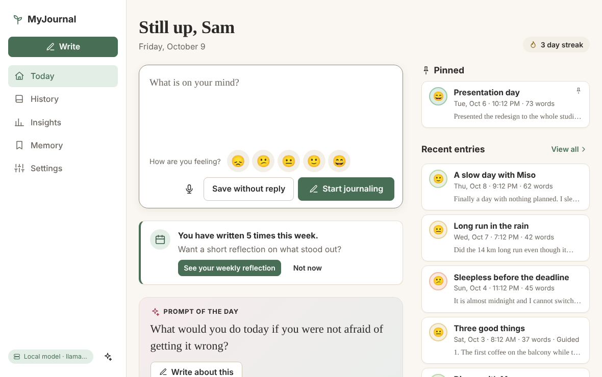
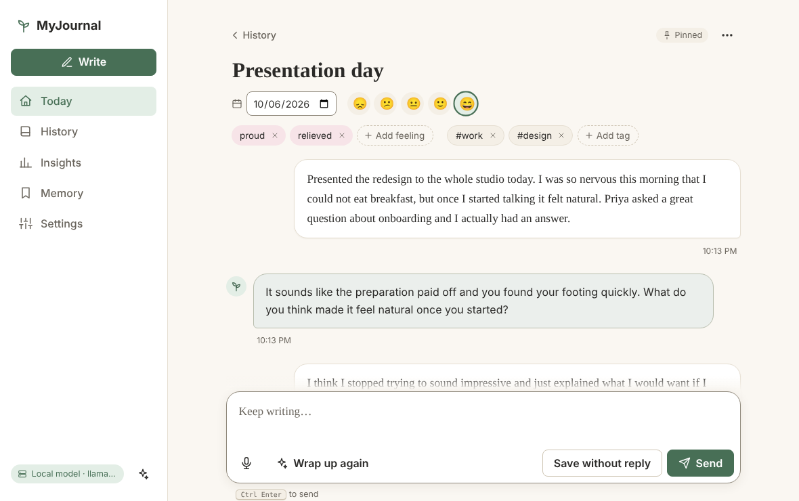
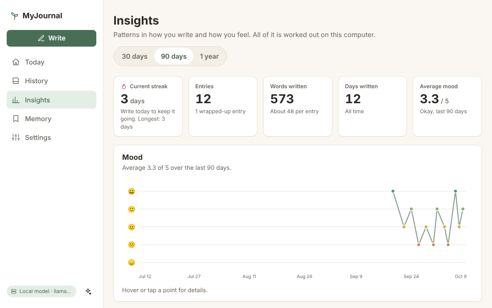
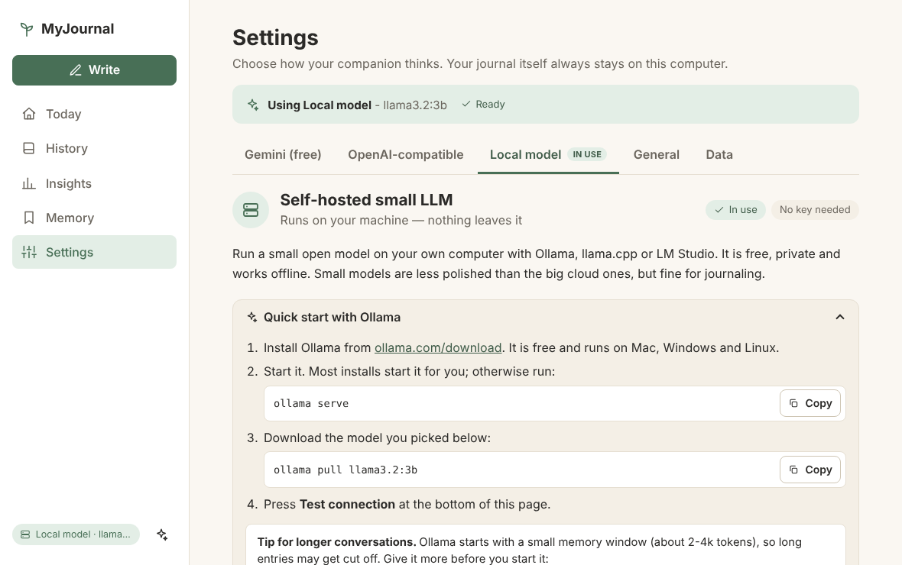

# MyJournal

**A private journal with an AI that asks the next good question.**

You write. A companion answers with one gentle follow-up, saves the lasting things you tell it (where you can see, edit and delete them), notices your moods and writes you a weekly reflection. Your journal is a single file on your own computer, and you bring your own model: a free Gemini key, any OpenAI-compatible API, or a small model running on your own machine so that nothing leaves it.

One Node.js program with **no dependencies to install**, no account and no telemetry. Prefer no AI at all? It is still a calm, fast, private journal.

<!-- screenshots: the lead will add docs/img/*.png -->

| Today | An entry |
|---|---|
|  |  |

| Insights | Settings |
|---|---|
|  |  |

- [Why](#why) · [Quick start](#quick-start) · [What you get](#what-you-get)
- [Connect a model](#connect-a-model): [free Gemini](#a-free-gemini-key) · [OpenAI and compatible](#b-openai-or-any-openai-compatible-api) · [your own machine](#c-a-small-model-on-your-own-machine) · [Tested with](#tested-with)
- [Run it in Docker](#run-it-in-docker) · [Configuration reference](#configuration-reference)
- [Your data and privacy](#your-data-and-privacy) · [Security model](#security-model)
- [Project layout](#project-layout) · [Development](#development)
- [Limitations and roadmap](#limitations-and-roadmap) · [FAQ and troubleshooting](#faq-and-troubleshooting) · [License](#license)
- More: [docs/PROVIDERS.md](docs/PROVIDERS.md) (every provider in depth), [docs/PRIVACY.md](docs/PRIVACY.md) (what leaves your machine), [docs/ARCHITECTURE.md](docs/ARCHITECTURE.md) (how it is built)

## Why

A diary is the most private thing most people write, yet AI journaling usually means an account, a subscription and your entries on someone else's servers. MyJournal is the other way round:

- **Yours.** One SQLite file in a folder you choose. Export everything as JSON or Markdown at any time. No account, no analytics, no update check.
- **Your model.** Use a free Gemini key, any OpenAI-compatible service, or a small model on your own computer that works offline. Switch whenever you like.
- **Honest about it.** [docs/PRIVACY.md](docs/PRIVACY.md) lists, request by request, what each provider receives. Small models are small, and this README says what was measured and what was not (see [Tested with](#tested-with) and [Limitations](#limitations-and-roadmap)).

## Quick start

About a minute. You need **Node.js 22.13 or newer**. There is no `npm install` and no build step.

```bash
node --version        # v22.13 or newer
git clone https://github.com/Kak-Palel/myjournal.git
cd myjournal
npm start
```

1. Open **http://127.0.0.1:3210**. The welcome screen asks which model your companion should use.
2. Pick one:
   - **Free Gemini** (*Use Gemini*) is the quickest real AI: create a key at <https://aistudio.google.com/apikey>, paste it, press **Test connection**, then **Use this provider**. ([Details](#a-free-gemini-key).)
   - **Local small model** (*Run it locally*) keeps everything on your computer: install [Ollama](https://ollama.com/download), run `ollama pull llama3.2:3b`, and pick it. ([Details](#c-a-small-model-on-your-own-machine).)
   - **OpenAI-compatible** (*Use my own API*) takes an API key and, for services other than OpenAI, a base URL. ([Details](#b-openai-or-any-openai-compatible-api).)
   - **Just journal, no AI** skips all of it. You can add a model later under Settings.
3. Write something on **Today** and press **Start journaling**.

Already have `GEMINI_API_KEY` or `OPENAI_API_KEY` in your environment? The welcome screen says *Found GEMINI_API_KEY in your environment* and the setup is one step: **Test connection**.

Want to look around first, with no key at all? `npm run demo` starts the whole app with pretend models and three weeks of sample entries in a temporary folder that is deleted when you stop it. The replies are canned (nothing there is a real AI), but every screen works.

Stop the server with Ctrl+C. The terminal prints where your data lives: by default `./data/journal.db`, relative to the folder you started `npm start` in. The server listens on this computer only (`127.0.0.1`), so nobody else on your network can reach it. Another port: `PORT=3211 npm start` (Windows PowerShell: `$env:PORT=3211; npm start`).

## What you get

| | |
|---|---|
| **Write** | A blank page with the prompt of the day, or one of 12 guided sessions: Rose, Thorn, Bud · Gratitude · Morning intention · Evening reflection · Thought record · Worry dump · Self-compassion · Goals check-in · Relationship reflection · Dream journal · Weekly review · Decision helper. |
| **Talk** | Each reply responds to what you wrote and ends with one open question. **Stop** any time, **Regenerate** a reply, or **Save without reply** when you just want to write. Personas: Companion, Coach, CBT-style guide, Stoic, Friend, or a voice you describe. |
| **Remember** | After **Wrap up** the companion can save short lasting facts ("has a younger sister called Maya"). They are listed on the **Memory** page: add, edit, pin, delete, or switch memory off. It can also recall a few related older entries while it replies. |
| **Reflect** | A mood from 1 to 5 on any entry. Wrap-up writes a closing reflection plus a title, summary, feelings and tags, all editable. **Insights**: streak, words written, average mood, mood chart, a calendar of the days you wrote, top feelings and tags. One button writes a **weekly reflection** over the last 7, 14 or 30 days. |
| **Find** | Full-text search, filters for mood, tag and pinned, entries grouped by month. |
| **Take it with you** | Download everything as JSON (re-importable) or Markdown, or one entry as Markdown. Import merges a JSON export without overwriting anything. |
| **Keep it private** | Mark an entry **Private** to keep it out of memory, recall and weekly reflections (it still goes to your AI provider when you ask for a reply in it: [see below](#your-data-and-privacy)). |
| **Dictate** | A Dictate button in browsers that support speech recognition. The browser, not MyJournal, does the listening ([PRIVACY](docs/PRIVACY.md#voice-dictation)). |
| **Anywhere** | Works with no AI at all. Light and dark theme, keyboard friendly, a phone-sized layout. English interface. |

> MyJournal is a journaling tool, not therapy. It shows a gentle, fixed care message when your writing mentions being in danger, but it cannot call for help and it is not a substitute for a professional or a crisis line.

## Connect a model

Pick one. You can switch any time under **Settings**; each provider keeps its own key, address and model. The flow is the same everywhere: open the provider's tab, fill in the fields, press **Test connection**, then **Use this provider**.

| | Needs | Costs | Where your text goes | Tried against the real thing? |
|---|---|---|---|---|
| [Free Gemini](#a-free-gemini-key) | a Google account | free tier, with limits | Google | yes, 2026-10-08 |
| [OpenAI-compatible](#b-openai-or-any-openai-compatible-api) | an API key | pay per use | the service you choose | **no** (mock servers and documentation only) |
| [Your own machine](#c-a-small-model-on-your-own-machine) | a computer with a few GB of free memory | free | nowhere, it stays on your machine | yes: Ollama 0.40.1 and llama.cpp; LM Studio and vLLM no |

### A. Free Gemini key

1. Open <https://aistudio.google.com/apikey>, sign in with a Google account and create an API key.
2. In MyJournal choose **Use Gemini** on the welcome screen (or **Settings → Gemini (free)**), paste the key, press **Test connection**, then **Use this provider**.

Or give the key through the environment (it is then never written to the journal file):

```bash
GEMINI_API_KEY=your-key npm start
```

An environment key alone does not switch the AI on: you still pick **Gemini** once on the welcome screen or in Settings (the terminal reminds you). But you paste nothing: the welcome screen says *Found GEMINI_API_KEY in your environment*, and one **Test connection** finishes the setup.

**Model.** The default, `gemini-flash-lite-latest`, is the recommended one: measured live, its first word arrives in about a second (0.4 to 1.4 s, one 13 s outlier) and it has the most generous free quota. `gemini-flash-latest` is meant to be smarter, but it answered `503 "high demand"` to all 6 normal requests we sent it, and the one request that got through (with Low thinking) took 23 s to the first word. Use **Load models** to see what your key can use.

**Thinking** (Settings → Gemini → Advanced). Leave it on **Auto**. **Low** asks a model to think less; that helps Flash models that think before answering (`gemini-3.5-flash` and up), but the default Flash-Lite does not think, and measured live **Low makes it slower** (about 2.3 s to the first word instead of 0.9 s). More: [docs/PROVIDERS.md](docs/PROVIDERS.md#google-gemini).

> **Free-tier privacy warning.** On Google's free tier your prompts and the model's answers may be used to improve Google's products and may be read by human reviewers. A key on a billing-enabled project is not used that way. **Do not journal secrets with a free key.** If that matters to you, use a local model.

**Behind a company proxy?** Node's built-in `fetch` ignores `HTTPS_PROXY` unless the process is started with `NODE_USE_ENV_PROXY=1` (Node 22.21 or newer):

```bash
NODE_USE_ENV_PROXY=1 HTTPS_PROXY=http://proxy.example.com:3128 NO_PROXY=localhost,127.0.0.1 npm start
```

Set these in the real environment, not in `.env` (Node reads them before the app starts). Keep `localhost,127.0.0.1` in `NO_PROXY` if you also use a local model, or those requests go to the proxy too. If the proxy re-signs HTTPS, also set `NODE_EXTRA_CA_CERTS=/path/to/company-ca.pem`.

### B. OpenAI, or any OpenAI-compatible API

> **Not tested against the real service.** The machine this was developed and verified on had no network access to OpenAI (nor to OpenRouter, Groq or Together). The adapter is verified against mock servers, against the documented API, and, for the wire format it shares with them, against real Ollama and llama.cpp servers. Expect it to work; if it does not, the error message and [the troubleshooting table](docs/PROVIDERS.md#troubleshooting-every-error-code) are the place to start.

1. Create an API key with your provider.
2. **Settings → OpenAI-compatible**: paste the key. Under **Base URL**, press a preset or type your own:

   | Service | Base URL | Model names look like |
   |---|---|---|
   | OpenAI | `https://api.openai.com/v1` | `gpt-4o-mini` (the default) |
   | OpenRouter | `https://openrouter.ai/api/v1` | `vendor/model`, for example `openai/gpt-4o-mini` |
   | Groq | `https://api.groq.com/openai/v1` | press **Load models** |
   | Together | `https://api.together.xyz/v1` | press **Load models** |

   Any other service that speaks the OpenAI "chat completions" API (DeepSeek, Mistral, a company gateway, LiteLLM, vLLM, …) works the same way with its own base URL, which normally ends in `/v1`.
3. Press **Load models** to pick a model your key can use (or type its name), **Test connection**, **Use this provider**.

Through the environment instead:

```bash
OPENAI_API_KEY=sk-... npm start
# another service:
OPENAI_API_KEY=... OPENAI_BASE_URL=https://openrouter.ai/api/v1 npm start
```

`OPENAI_BASE_URL` (like `LOCAL_LLM_BASE_URL` and `LOCAL_LLM_MODEL`) only provides the *starting* value of a **fresh install**, meaning one where nothing has been saved in Settings yet. The first time you press Save, whatever Settings shows is stored and the variable never changes it again (you can even pick the built-in default on purpose).

Your journal text goes to whatever service is behind the base URL: check its data retention and training policy. Azure-style URLs (a `?api-version=` query string, an `api-key` header) are not supported; see [docs/PROVIDERS.md](docs/PROVIDERS.md#openai-compatible-apis).

### C. A small model on your own machine

Nothing leaves your computer, it works offline and it costs nothing, at the price of simpler conversations than the big cloud models give. What we measured with real small models (details under [Tested with](#tested-with)): a **360M** model is only good enough to test the plumbing, a **1B** model connects and replies but stays basic and sometimes misses the "one question" rule, **1.7B** (`qwen3:1.7b`) was clearly better, and the advice to use **3B and up** for a pleasant chat is an extrapolation from that trend (we did not run a 3B model). The default, `llama3.2:3b`, is about 2 GB.

#### Ollama (the easy way)

1. Install Ollama from <https://ollama.com/download> (macOS, Windows, Linux). Most installs start it for you; otherwise run `ollama serve`.
2. Download a model:

   ```bash
   ollama pull llama3.2:3b        # the default, about 2 GB
   ollama pull qwen3:1.7b         # smaller: the best of the small models we measured
   ```

   Other choices in the app's picker: `llama3.2:1b` (about 1.3 GB, testing only), `qwen2.5:1.5b`, `gemma2:2b`, `smollm2:1.7b`. Any model your server has works if you type its name.
3. Give it a bigger memory window if you can. Ollama's default is 4096 tokens (we measured exactly that on a CPU-only machine; its help says "4k/32k/256k based on VRAM"), which MyJournal's default settings fit, but longer conversations are shortened sooner. Start it with more:

   ```bash
   OLLAMA_CONTEXT_LENGTH=8192 ollama serve
   ```

   (Windows PowerShell: `$env:OLLAMA_CONTEXT_LENGTH=8192; ollama serve`.) If Ollama runs as a background service or app, set `OLLAMA_CONTEXT_LENGTH` in that service's environment and restart it. A larger window uses more memory (llama3.2:1b went from 1.95 GB to 2.17 GB).
4. In MyJournal: **Settings → Local model**. The default address `http://localhost:11434/v1` is already the Ollama preset and the default model is `llama3.2:3b`. Press **Test connection**, then **Use this provider**.

Skip step 2 if you like: the **Download model** button on that tab fetches the model through your Ollama server and shows progress (it turns into *Already installed* when the model is there). The very first reply after a download is slower while the model loads into memory.

#### llama.cpp

```bash
llama-server -m model.gguf --port 8080 -c 4096
```

In **Settings → Local model** press the **llama.cpp** preset (`http://localhost:8080/v1`), then **Load models**, pick the one that appears (it is the GGUF file you started the server with) and **Test connection**. `-c` is the context window in tokens; use at least 4096 (without it `llama-server` uses the model's own maximum, which can need a lot of memory).

#### LM Studio

Load a model in LM Studio and start its local server (default port 1234), then press the **LM Studio** preset (`http://localhost:1234/v1`), **Load models**, **Test connection**. (Not run by us; this follows LM Studio's documentation.)

#### Good to know

- **Context window.** If the model's window is smaller than what MyJournal sends, long entries get cut or you see a "too long for the model" error. The default *Context budget* (3,000, counted conservatively) fits a 4,096-token window: in a test with 21 replies the largest real prompt was 2,278 tokens and none was cut. For a 2,048-token window lower it in Settings → General to about 1,500; if you raise the window you can raise the budget with it. A budget larger than the window backfires: with 6,000 on a 4,096 window Ollama trimmed silently and replies went from 4.7 s to 30 s. See [docs/PROVIDERS.md](docs/PROVIDERS.md#context-windows-and-the-truncation-trap).
- **Long conversations stay fast.** Ollama and llama.cpp keep the processed start of the prompt and only compute what is new. So for local models MyJournal drops the oldest turns of a long conversation in blocks (8 at a time) rather than one per reply, which keeps that start unchanged for several replies: in a 30-turn test on llama3.2:1b the median reply fell from about 9 s to 2.7 s.
- **First reply is slow.** The first request after starting a model loads it into memory (1 to 7 s for the models we measured, longer for big ones or slow disks). The default wait for the first word is 180 seconds; raise *Wait for the first word* in Settings → General if it still times out.
- **"Thinking" models** (qwen3-style) are handled: MyJournal asks them not to think (a `qwen3:1.7b` reply took about 4 s instead of 8 to 14 s) and strips any `<think>…</think>` text that still arrives.
- **Memory suggestions from small models are unreliable.** With a 1B model most suggested facts were junk (1 valid of 5 stored). Look at the **Memory** page now and then, or switch off *Suggest memories when I wrap up an entry* there.
- A local server on *another* computer works too (set its address), but your text then travels to that computer, over plain `http://` unless you set up HTTPS.

## Tested with

What was actually run, and what was not. Measured on 2026-10-08. The full tables, with hardware and raw numbers, are in [docs/PROVIDERS.md](docs/PROVIDERS.md#tested-with).

| Provider | How it was verified | Result |
|---|---|---|
| **Google Gemini**, free tier | The real API: more than 200 requests across the adapter, the whole app over HTTP and the browser UI | `gemini-flash-lite-latest` (now `gemini-3.5-flash-lite`): first word 0.4 to 1.4 s (one 13 s outlier), no thinking by default, replies of about 50 words in 2 to 4 sentences, wrap-up in about 3 s. `gemini-flash-latest` answered `503` to all 6 normal requests. No `429` was ever provoked, so the rate-limit messages follow Google's documented format. |
| **Ollama 0.40.1**, official image, CPU only (4 cores, 16 GB RAM) | Real models: `llama3.2:1b` (Q8_0), `qwen3:1.7b` (Q4_K_M), `smollm2:360m` (Q4_K_M), imported from GGUF files. The whole app was driven against them, except a real model download: the Ollama registry was unreachable there, so `ollama pull` and Download model's success path were not run (its error path was). | Works. 4096-token default window. See the model table below. |
| **llama.cpp** `llama-server` (the build bundled in that image) | The same three models | Works: streaming, model list (GGUF file name), the exact context-overflow error with both numbers. |
| **OpenAI API** (and OpenRouter, Groq, Together, …) | **Not tested.** No network access to them from the development machine. | Mock servers and the documented API only. |
| **LM Studio**, **vLLM** | **Not tested.** | Documentation only. |
| The app itself | `npm test` (about 1,470 tests with mock servers), `npm run test:e2e` (165 browser tests in Chromium), an accessibility audit with axe | All pass. Not run: Firefox, Safari, a real phone and its keyboard, macOS, Windows. |

The local models, on that CPU-only machine (4 cores):

| Model | In memory | Speed | Cold start | A typical reply | For journaling |
|---|---|---|---|---|---|
| `smollm2:360m` (271 MB) | 0.5 GB | 44 tokens/s | 1.1 s | 7 to 8 s: it writes 200+ words | **Plumbing tests only.** Ignores the "2 to 4 sentences" rule, sometimes loops, invents details. |
| `llama3.2:1b` (1.3 GB) | 1.9 GB | 26 tokens/s | 4.7 s | 2.6 to 3.6 s | **Basic.** Replies make sense, but only about 3 in 4 end with exactly one question, it mentions facts from your profile in about 1 unrelated reply in 6, and its memory suggestions are mostly wrong. |
| `qwen3:1.7b` (1.1 GB) | 1.8 GB | 13 tokens/s | 3.9 s | 3.7 to 4.7 s (thinking off) | **Fine.** 93% of replies within 2 to 4 sentences, 92% with one closing question, always in your language, no profile leaks. Slower to write. |
| `llama3.2:3b`, 7B and up | not run | | | | **Recommended, not measured.** The trend above (bigger is better) is the only evidence. |

Gemini Flash-Lite is the quality reference: in the same 26-reply check every reply was 2 to 4 sentences with one closing question, in the user's language. The counts come from 17 short fictional conversations, run after the prompts had been tuned against these very models, so read them as a rough ordering, not as precise rates; the evidence, model by model, is in [docs/PROVIDERS.md](docs/PROVIDERS.md#how-well-small-models-follow-the-rules).

## Run it in Docker

Optional. Needs Docker with Compose v2. The container listens on all interfaces *inside* Docker, so a password is **required** (the server refuses to start without one), and the compose file publishes the port on `127.0.0.1` only. (The compose file was checked with `docker compose config` and the Dockerfile with a linter, and the container's exact start and health-check commands were run natively. No Docker daemon was available where this was written, so the image itself was not built and started.)

```bash
cp .env.example .env          # then edit .env and set JOURNAL_PASSWORD to a long passphrase
docker compose up -d --build
```

Open <http://127.0.0.1:3210> and sign in. Your journal is in the `journal-data` Docker volume.

With a small model in a container too (CPU is fine; the default model is about 2 GB):

```bash
docker compose --profile ollama up -d --build
docker compose logs -f ollama-pull      # watch the one-time download
```

Then choose **Local small model** on the welcome screen (or **Settings → Local model**). The compose file points a *fresh* install at the bundled Ollama (`http://ollama:11434/v1`); if you already saved settings before enabling the profile, set that address once in **Settings → Local model**. `docker compose down` stops everything and keeps your data; `docker compose down -v` also **deletes the volumes, journal included**. Details, hardening choices and the Ollama-on-the-host variant are commented in [docker-compose.yml](docker-compose.yml). Without Compose:

```bash
docker build -t myjournal .
docker run -d --name myjournal -p 127.0.0.1:3210:3210 -v myjournal-data:/data \
  -e JOURNAL_PASSWORD='a long passphrase' myjournal
```

## Configuration reference

Everything is optional. Set variables in the environment, or in a `.env` file in the folder you start the server from ([.env.example](.env.example) lists them all; real environment variables win over the file).

| Variable | Default | What it does |
|---|---|---|
| `PORT` | `3210` | Port to listen on. `0` picks a free one. |
| `HOST` | `127.0.0.1` | Address to listen on. Anything but a loopback address (for example `0.0.0.0`) needs `JOURNAL_PASSWORD` or `JOURNAL_INSECURE_ALLOW_NO_AUTH=1`, otherwise the server refuses to start. |
| `JOURNAL_DATA_DIR` | `./data` | Folder for `journal.db`. A relative path is relative to the folder you start in. |
| `JOURNAL_PASSWORD` | none | Password to sign in. Not stored anywhere but your environment; changing it signs everyone out. |
| `JOURNAL_ALLOWED_HOSTS` | none | Extra `Host` header values to accept, comma separated (`journal.example.com` any port, `journal.example.com:8443` that port only). Needed behind a reverse proxy on the same computer; see [Host checks](#security-model). |
| `JOURNAL_INSECURE_ALLOW_NO_AUTH` | off | `1`, `true` or `yes`: allow a non-loopback `HOST` without a password. Only if something else in front already does the login. |
| `GEMINI_API_KEY` | none | Gemini key (`GOOGLE_API_KEY` is read too). A key saved in Settings wins. |
| `OPENAI_API_KEY` | none | Key for the OpenAI-compatible provider. |
| `OPENAI_BASE_URL` | `https://api.openai.com/v1` | Starting base URL for that provider (fresh installs only). |
| `LOCAL_LLM_BASE_URL` | `http://localhost:11434/v1` | Starting address of the local model server (fresh installs only). |
| `LOCAL_LLM_MODEL` | `llama3.2:3b` | Starting model name for the local provider (fresh installs only). |
| `LOCAL_LLM_API_KEY` | none | Only if your local server wants a key (Ollama does not). |
| `NODE_USE_ENV_PROXY`, `HTTPS_PROXY`, `HTTP_PROXY`, `NO_PROXY`, `NODE_EXTRA_CA_CERTS` | none | Node's own variables, for company proxies. See [above](#a-free-gemini-key). Must be in the real environment, not in `.env`. |

Keys from the environment are never written to the journal file. The three `*_BASE_URL` / `LOCAL_LLM_MODEL` variables only seed a **fresh install**: one with no settings saved yet. The first Save in the app (the welcome screen's first choice counts) stores what Settings shows, and from then on the variables never override it (see [B](#b-openai-or-any-openai-compatible-api)); wiping everything *including settings* makes the install fresh again. So adding them later, say by enabling the compose `ollama` profile for an existing journal, has no effect: set the address in Settings.

Docker Compose adds `JOURNAL_HOST_PORT` (host port, default `3210`), `TZ`, `OLLAMA_MODEL` and `OLLAMA_CONTEXT_LENGTH`; they are explained in `.env.example`.

**Settings in the app** (Settings → General) and their limits:

| Setting | Default | Range |
|---|---|---|
| Creativity (temperature) | 0.7 | 0 to 2 |
| Longest reply (tokens) | 700 | 64 to 8192 |
| Context budget (tokens, approximate) | 3000 | 500 to 32000 |
| Wait for the first word (seconds) | 180 | 5 to 600 |
| Memory, suggest memories after wrap-up, recall related entries | all on | on / off |
| Use the AI companion | on | on / off |

## Your data and privacy

- **Where it lives.** One SQLite file, `journal.db`, in the data folder (plus `journal.db-wal` and `-shm` files while the server runs). Entries, your messages, the companion's replies, memories, reports and your settings are all in it. The folder is created readable by you only. Nothing is stored anywhere else, except a few small things in your browser: your theme, the Insights range you picked, and an unsent draft while you type (it is removed once the text is saved).
- **What leaves your computer.** Only AI requests, and only to the provider you chose. With a local model on this computer, nothing. MyJournal has no accounts, no analytics and no telemetry, and the web page loads no scripts, fonts or images from other sites.
- **What a reply sends.** The current conversation (shortened to your context budget), today's date, your name and "About you" text, your memories, the mood you logged for the entry, a guided session's instructions and, if *Recall related past entries* is on, a few short excerpts of older entries (never private ones), and nothing else. Not the rest of your journal, not your settings, not your keys. Wrap-up repeats the conversation for the closing reflection, then sends only what *you* wrote for the title-and-summary step, and what you wrote plus your known memories for the memory step. A weekly reflection sends titles, summaries or short excerpts, moods, feelings and tags of that period's non-private entries, plus your memories.
- **Private flag.** A private entry is kept out of memory, recall and weekly reflections. **It is still sent to your AI provider when you ask for a reply in it**: replies in a private entry are written by the same provider as any other. Use **Save without reply**, or switch the AI off, for text no model should see.
- **API keys** you paste into Settings are stored **unencrypted** in `journal.db`. If that matters, leave the key fields empty and use the environment variables instead; keys from the environment are never written to the file. Exports never contain settings or keys.
- **Backups, moving and deleting.** Copy the data folder while the server is stopped, or use **Settings → Data → Export** (JSON restores everything; Markdown is for reading). **Settings → Data → Delete everything** removes entries, messages, memories and reports (optionally settings and keys too) and compacts the file; there is no undo.

The complete picture, per provider: [docs/PRIVACY.md](docs/PRIVACY.md).

## Security model

MyJournal is built for **one person on a computer they control**.

- **Loopback by default.** It listens on `127.0.0.1`. Listening on any other address makes it refuse to start unless you set a password (or explicitly opt out with `JOURNAL_INSECURE_ALLOW_NO_AUTH=1`).
- **Password.** With `JOURNAL_PASSWORD` set, every API call needs a session (a random token in an HTTP-only, same-site cookie named `mj_session_<port>`, valid 30 days, kept in memory, so a restart signs you out). After 5 wrong passwords from one address, sign-in waits a minute. There is one password for one person. After signing in you return to the page you were on (or had asked for); a deliberate sign-out lands on Today.
- **Host checks.** The server only answers requests whose `Host` header is `localhost`, `127.0.0.1`, `[::1]`, the address you set in `HOST` or an entry of `JOURNAL_ALLOWED_HOSTS` (a defence against DNS-rebinding attacks from web pages). The check is on whenever no password is set, and also when a password is set but the server listens on loopback. It is off only for a non-loopback `HOST` with a password.
- **CSRF.** Every state-changing request must carry `X-MyJournal: 1` and, when the browser sends an `Origin`, that origin must match the `Host` (or `X-Forwarded-Host`). No CORS headers are ever sent.
- **Browser hardening.** A strict Content-Security-Policy (`default-src 'self'`, no inline scripts or styles), `nosniff`, `Referrer-Policy: no-referrer`, `X-Frame-Options: DENY`; the app is plain JavaScript with no third-party code, and all AI text is rendered as text, never as HTML.
- **Not protected, by design:** there is **no encryption at rest** (anyone who can read the data folder can read the journal and any saved API key; use disk encryption), **no HTTPS** (put a reverse proxy with TLS in front before using it beyond your own computer: the password and cookie otherwise travel in clear text), **no multi-user separation**, and no protection against malware or someone using your signed-in browser.

## Project layout

```text
server.js            entry point: checks the Node version, loads .env and config, opens the database, starts the server
src/config.js        environment -> configuration, the .env loader, the startup safety rule
src/settings.js      settings defaults, validation, merging, key masking
src/providers/       the model adapters: openai.js (OpenAI-compatible + local), gemini.js, errors, SSE parsing
src/db/              SQLite storage (node:sqlite): entries, messages, memories, reports, search, export/import
src/journal/         pure journaling logic: prompts, language detection, personas, guided templates, insights, safety
src/server/          HTTP layer: routes, security, auth, generation (streaming), static files
public/              the web app: plain JavaScript modules and CSS, no build step
scripts/             demo.js (npm run demo), check.js (npm run check)
test/                unit and integration tests, mock model servers, recorded real responses, browser tests
docs/                PROVIDERS.md, PRIVACY.md, ARCHITECTURE.md
Dockerfile, docker-compose.yml, .env.example
```

## Development

Node 22.13 or newer. The product has zero dependencies; keep it that way.

```bash
npm start            # run the server
npm run dev          # same, restarting on file changes
npm test             # unit + integration tests with mock model servers (about 1,470 tests, 1-2 minutes)
npm run check        # node --check on every script, and no innerHTML / eval anywhere in public/
npm run test:e2e     # real-browser journeys (165 tests, about 5 minutes); needs Playwright + Chromium (not dependencies), skipped without them
npm run mock-llm     # pretend model servers on :11500 (OpenAI/Ollama style) and :11501 (Gemini)
npm run demo         # the whole app on pretend models with sample data
```

Everything that talks to a model is tested against mock servers in `test/mocks`, and the Gemini, Ollama and llama.cpp adapters also against responses recorded from the real services (`test/fixtures`). The browser tests are described in [test/e2e/README.md](test/e2e/README.md). How the pieces fit: [docs/ARCHITECTURE.md](docs/ARCHITECTURE.md).

## Limitations and roadmap

What it is not, today:

- **One person, one computer.** No accounts, no sync between devices, no sharing. To use it from a phone, host it somewhere you control (see [reverse proxy](#faq-and-troubleshooting)).
- **No encryption at rest, no built-in HTTPS.** See [Security model](#security-model).
- **Text only.** No images, audio recordings or attachments. Voice dictation turns speech into text through your browser.
- **English interface.** The companion answers in the language you write in (checked on Spanish, French and Japanese with real models), but small local models are much weaker outside English.
- **Small models are small.** A 360M model is not usable for journaling and a 1B model stays basic: it ends a reply with exactly one question only about 3 times in 4, now and then brings up things from your profile that do not belong, and its memory suggestions are mostly wrong. Review the Memory page, or prefer 1.7B and up (see [Tested with](#tested-with)).
- **Not everything was tried for real.** The OpenAI API, LM Studio and vLLM were not run (no access), no model of 3B or more was run, a Gemini rate-limit (`429`) was never provoked, and the app was exercised in Chromium on Linux only: Firefox, Safari, a real phone with its on-screen keyboard, macOS and Windows are untested.
- **Search is keyword-based**, not semantic, and "related entries" use the same search.
- **Import** understands MyJournal's own JSON export only.
- **Sessions are in memory:** restarting the server signs you out.
- **No automatic backups.**
- Dictation does not exist in Firefox.

Ideas that are not built (no promises): optional encryption at rest, importers for other journal apps, semantic search, an interface in other languages.

## FAQ and troubleshooting

**"Port 3210 is already in use."** Is MyJournal already running? Pick another port: `PORT=3211 npm start`.

**"MyJournal needs Node.js 22.13 or newer (this is v20.…)".** What `npm start` prints on an old Node. Install a current version from <https://nodejs.org> and run it again. (`npm run demo`, `npm test` and the other scripts do not check: on Node 20 or 21 they stop with `No such built-in module: node:sqlite`, which means the same thing.)

**"Could not connect to the local model server" (Ollama connection refused).** Ollama is not running or the address is wrong. Start it (`ollama serve`, or open the Ollama app), then check **Settings → Local model**: the address is `http://localhost:11434/v1`. Inside Docker, `localhost` is the container itself: use `http://ollama:11434/v1` for the bundled Ollama or `http://host.docker.internal:11434/v1` for one on the host.

**"That port is blocked."** Node's `fetch`, like web browsers, refuses to connect to a fixed list of ports (1, 7, 9, 6000, 6665 to 6669, 10080 and others; the "bad ports" of the Fetch standard) and the address in Settings uses one of them. Start your model server on another port and change the address. ("The server address is not valid" is a different problem: a typo in the address.)

**"The model … was not found."** The name in Settings is not a model your server has. For Ollama run `ollama pull <name>` or press **Download model**; for others press **Load models** and pick one from the list.

**"This conversation is too long for the model", or replies that ignore earlier text.** The model's context window is smaller than what is sent. Raise the window (Ollama: `OLLAMA_CONTEXT_LENGTH=8192`, llama.cpp: `-c`) and/or lower Settings → General → *Context budget*. Details: [docs/PROVIDERS.md](docs/PROVIDERS.md#context-windows-and-the-truncation-trap).

**The first reply from a local model takes ages or times out.** The model is being loaded into memory. Give it time and raise *Wait for the first word* (Settings → General; the default is 180 seconds). **Test connection** waits as long as that setting says for a local model (up to 300 seconds), and 90 seconds for Gemini and OpenAI-compatible services; **Load models** waits 20 seconds. Giving up cancels the load, so retrying at once starts it over.

**Gemini: "rate limit reached" (429).** The free tier allows only so many requests per minute. Wait the number of seconds the message gives and try again. **"The free daily limit … is used up"** means try tomorrow, switch model, or enable billing.

**Gemini: "Gemini is overloaded right now" (503).** Google's side is busy, usually briefly; `gemini-flash-lite-latest` is busy far less often than `gemini-flash-latest`. MyJournal retries a 503 once by itself, but only if it arrived quickly (within 8 seconds): one that took longer is shown at once instead of making you wait twice. **"Gemini is not available in your region"**: the free tier is not offered everywhere; use billing, another provider or a local model.

**"Gemini has retired …" or "This model is no longer available".** Google removed that model. Press **Load models** and pick a current one, or use `gemini-flash-lite-latest`.

**More error messages and what they mean:** the full table is in [docs/PROVIDERS.md](docs/PROVIDERS.md#troubleshooting-every-error-code).

**I forgot my password.** There is no stored password: it is whatever `JOURNAL_PASSWORD` says in your environment or `.env`. Change it there and restart.

**It asks for a password and I never set one.** Something set `JOURNAL_PASSWORD`: check your `.env` file and your shell. Remove it (and restart) to go back to no sign-in on a loopback address.

**"This address is not allowed to open the journal" (403 `forbidden_host`).** You opened it under a name the Host check does not know, such as a LAN address or `http://myserver:3210`. Use `http://localhost:3210`, or add the name to `JOURNAL_ALLOWED_HOSTS`, or listen on a non-loopback `HOST` with a password (which turns the Host check off).

**Behind a reverse proxy (nginx, Caddy, …).**

1. Make the proxy pass the original `Host` header, or send `X-Forwarded-Host`: otherwise saves fail with `forbidden_origin` ("This request comes from a different website").
2. If MyJournal listens on loopback (the default), add the public name: `JOURNAL_ALLOWED_HOSTS=journal.example.com`.
3. Send `X-Forwarded-Proto: https` from the TLS proxy so the session cookie is marked `Secure`.
4. Do not buffer streamed replies (MyJournal already sends `X-Accel-Buffering: no`, which nginx honours).
5. Failed sign-ins are counted per connecting address, and behind a proxy that is the proxy itself (`X-Forwarded-For` is not consulted): five wrong passwords from anyone lock everybody out for a minute. This does not weaken the password, but expect it.

```nginx
location / {
    proxy_pass http://127.0.0.1:3210;
    proxy_set_header Host $http_host;
    proxy_set_header X-Forwarded-Proto $scheme;
    proxy_buffering off;
    proxy_read_timeout 300s;
}
```

(Caddy: `reverse_proxy 127.0.0.1:3210` already forwards the original Host and handles streaming. These proxy snippets were not run here; adapt them to your setup.) Set a `JOURNAL_PASSWORD`: the proxy makes the journal reachable by others.

**Docker: the container exits right away.** `JOURNAL_PASSWORD` is missing. Compose tells you so; `docker run` needs `-e JOURNAL_PASSWORD=...`. **"permission denied" on a bind-mounted `/data`:** the folder must be writable by uid 1000.

**There is no microphone button.** Your browser has no speech recognition: Firefox does not offer it, Chrome does, others vary.

**Windows.** Use PowerShell syntax for variables: `$env:PORT=3211; npm start`. (Not tested on Windows.)

## Inspired by

MyJournal is an independent open-source project inspired by guided AI journaling apps in the style of Rosebud. It has no affiliation with, and is not endorsed by, Rosebud or anyone behind it.

## License

**License: not specified yet.** The owner has not chosen one.
